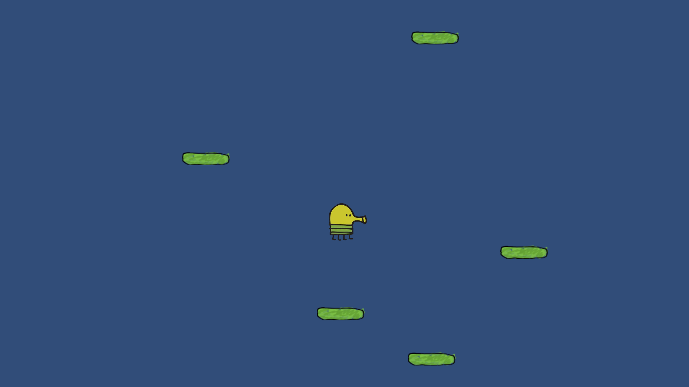

# code-remote-gamedev

Unity projektas "Doodle Jump" iš renginio [code-remote-gamedev](https://www.facebook.com/events/2700263113419030/). Lektorius [Saulius Bendikas](https://www.facebook.com/saulius.bendikas.5); projektas iš [Kipro Melnikovo (@sarpik)](https://github.com/sarpik).

## Reikalavimai

* [Unity](https://unity3d.com/get-unity/download)
